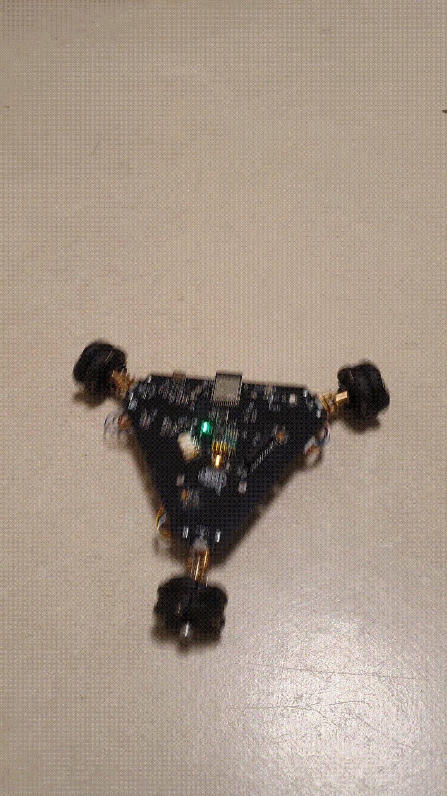
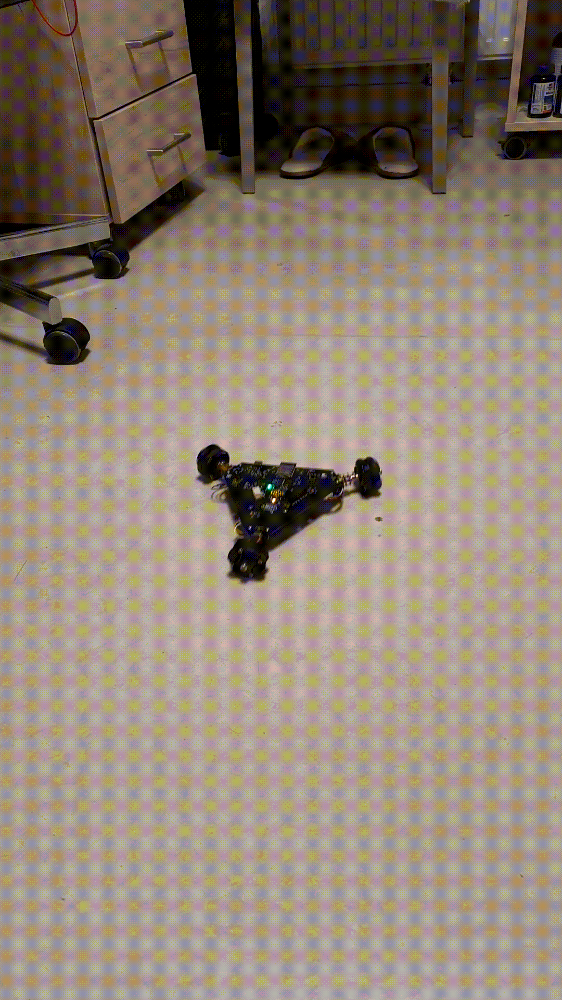
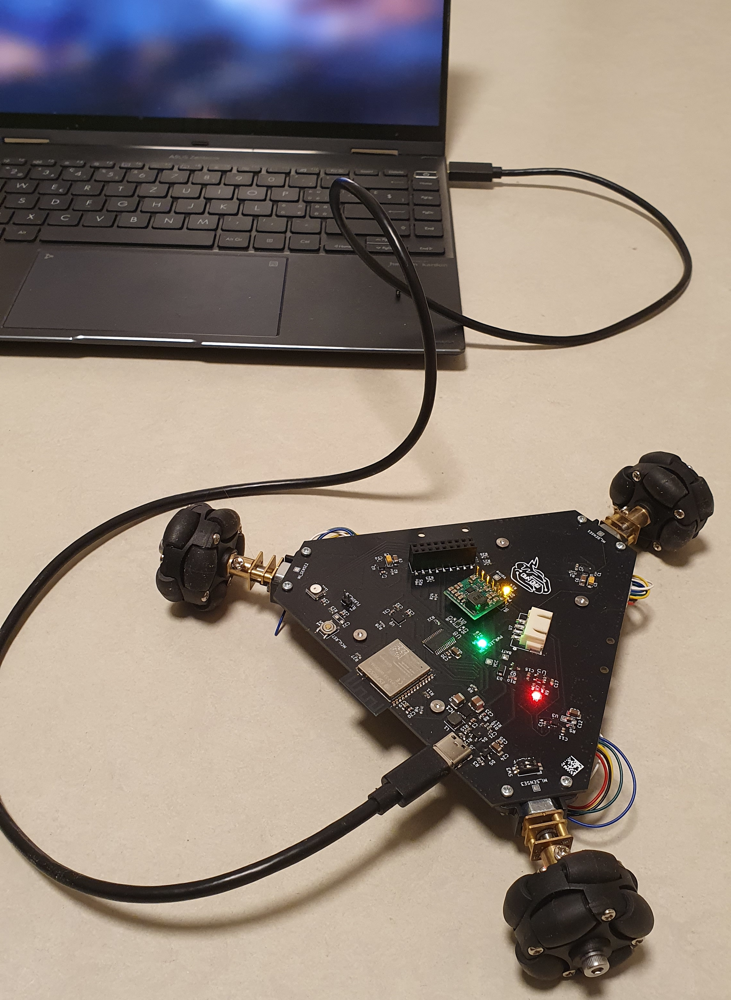

# Mad_Bot
Exploratory project in Embedded Robotics and Swarm Algorithms

Warning: This is an ongoing project, and the repository is under construction!

## Features
* Small PCB-based frame, minimum 3D printed parts
* ESP32-S3 MCU with vector instructions, acceleration for neural network computing and signal processing workloads
* Wi-Fi, Bluetooth 5 and BLE connectivity
* Omnidirectional movement
* Quadrature encoders for precise movement
* 8 MB PSRAM for image processing
* 2 Megapixel camera and ToF sensors for running embedded robotics algorithms
* Powered via USB-C or 3000mAh LiPo battery with inner protection and external charging circuit
* Load sharing circuit for operating the robot while charging
* Buck-Boost converter for powering the MCU and peripherals
* 6V regulator for powering the middle power range motors
* ESPNOW, ESP-WIFI-MESH or ESP-BLE-MESH for communication between several robots
* Integrated MEMS microphone for sound recognition
* micro-ROS support
**Note**: Software support for some features is still in progress.

## Fusion360 design
| | |
|--------------|------------|
|  |  |
|  |  |

## URDF model
<details>

| Robot | Wheel |
|--------------|------------|
|  |  |

</details>

## Operation demo
<details>

| Forward movement | Backward movement | Rotation |
|:----------------:|:-----------------:|:--------:|
|  |  |  |
<!-- |  |  |  | -->

</details>

### Charging mode
<details>

</details>

## Board layout
<details>

</details>

## Future work
- [ ] Add a BOM
- [X] Design a carrier extension in Fusion360
- [X] Test battery charging circuit
- [X] Test load sharing circuit
- [X] Test basic functionality with motors and ESP32-S3
- [X] Test Wi-Fi
- [X] Motors library (in progress)
- [X] Encoders testing
- [ ] **Device firmware (in progress)**
- [ ] **Sensors testing (in progress)**:
  - [ ] Camera
  - [X] ToF
  - [X] IMU
  - [ ] *MEMS microphone (requires PCB bug fix)*
- [ ] Remote controller based on ESP32
- [ ] PSRAM memory testing
- [X] **ROS2 integration via micro-ROS (in progress)**
- [ ] Web page with control interface and telemetry
- [X] URDF model
- [X] Joystick control via ROS2
- [ ] Digital twin for simulation in Gazebo and Mujoco
- [ ] ESPNOW and Mesh experiments
- [ ] Multi-agent algorithms
- [ ] Computer vision algorithms
- [ ] Mini SLAM experiments

## Fix list for new hardware revisions
* MEMS microphone footprint flipped
* Non-fixed Buck-Boost mentioned in the schematics instead of 3.3V fixed
* 6V regulator doesn't disconnect the load if disabled because of topology - extra switch needed
* Battery connector is hard to remove - source power switch needed
* Better (aligned) placement for camera & ToF sensors

## Software Troubleshooting

### micro-ROS build issues
If you encounter issue like [this](https://github.com/micro-ROS/micro_ros_espidf_component/issues/251) building micro-ROS for the ESP32-S3 platform, edit [`libmicroros.mk`](https://github.com/micro-ROS/micro_ros_espidf_component/blob/humble/libmicroros.mk) file at line 110 to include `esp32s3` as follows:

```makefile
ifeq ($(IDF_TARGET),$(filter $(IDF_TARGET),esp32s2 esp32c3 esp32c6 esp32s3))
```

## Acknowledgements
This project takes inspiration from the following open-source projects:
* https://github.com/YePeOn7/ros2_omni_robot_sim (omnidirectional drive kinematics)
* https://github.com/twistx77/V53L7CX-Library.git (ToF sensor library)
* https://github.com/natanaeljr/esp32-mpu-driver (IMU driver)
* Jonas Scharpf code pf the PCA9685 driver (motor PWM driver)