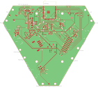
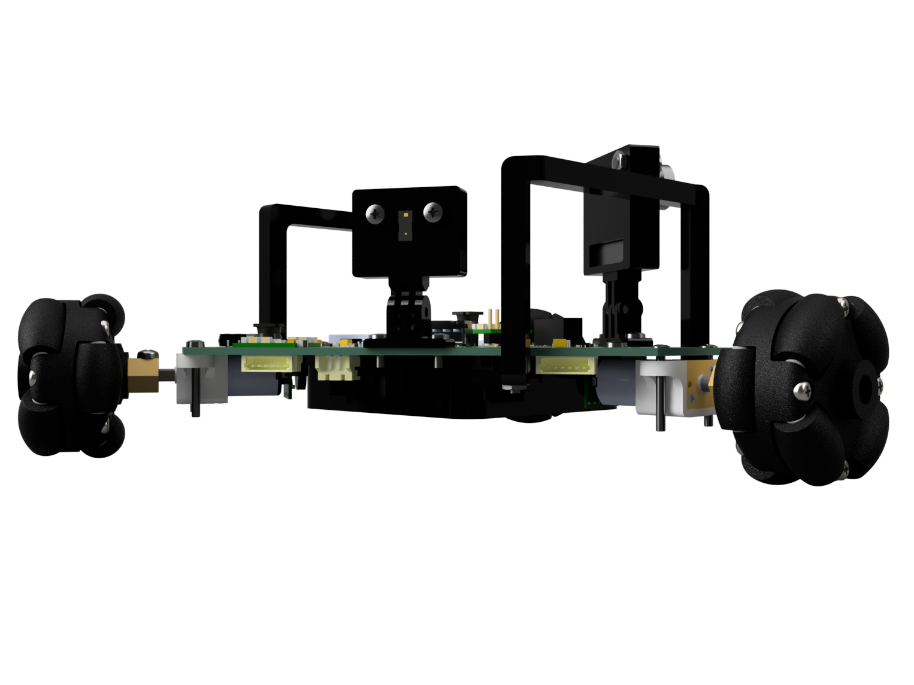
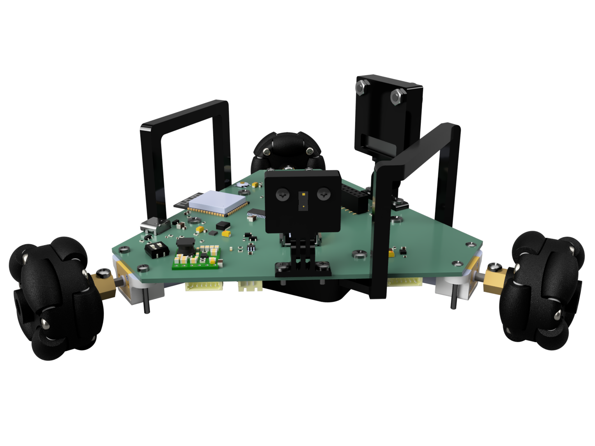
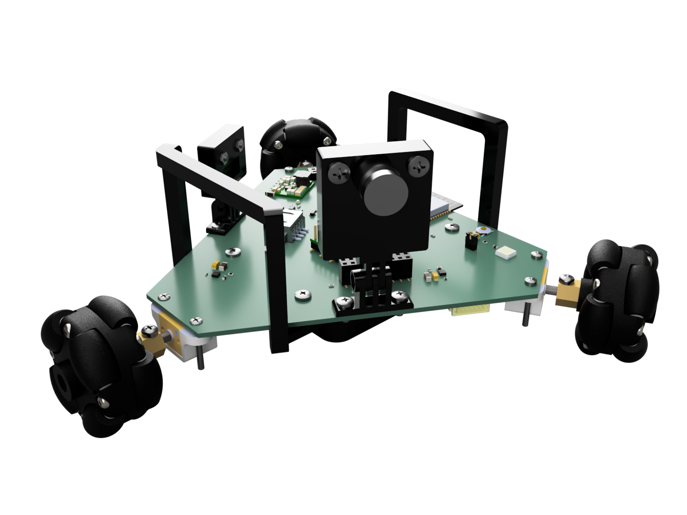
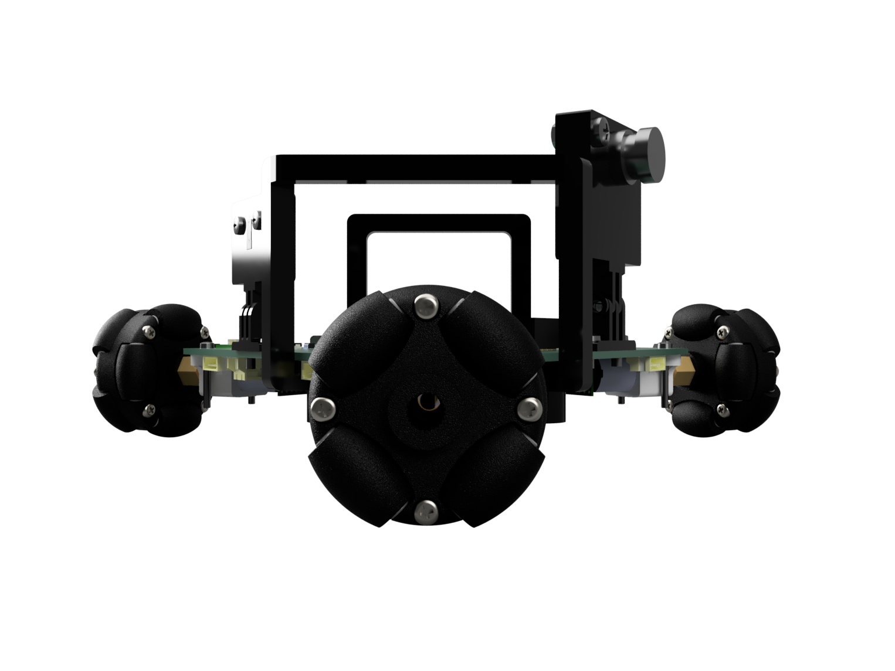

# Mad_Bot
Exploratory project in Embedded Robotics and Swarm Algorithms

Warning: This is an ongoing project, and the repository is under construction!

## Features
* Small PCB-based frame, minimum 3D printed parts
* ESP32-S3 MCU with vector instructions, acceleration for neural network computing and signal processing workloads
* Wi-Fi, Bluetooth 5 and BLE connectivity
* Omni-directional movement
* Quadrature encoders for precise movement
* 8 MB PSRAM for image processing
* 2 Megapixel camera and ToF sensors for running embedded robotics algorithms
* Powered via USB-C or 3000mAh LiPo battery with inner protection and external charging circuit
* Load sharing circuit for operating the robot while charging
* Buck-Boost converter for powering the MCU and peripherals
* 6V regulator for powering the middle power range motors
* ESPNOW, ESP-WIFI-MESH or ESP-BLE-MESH for communication between several robots
* Integrated MEMS microphone for sound recognition
* micro-ROS support

## Board layout

## Fusion360 design

## Future work
- [X] Test battery charging circuit
- [X] Test load sharing circuit
- [X] Test basic functionality with motors and ESP32-S3
- [X] Test Wi-Fi
- [ ] Add a BOM
- [ ] Create a code base
- [ ] Motors library and device firmware
- [ ] Web page with control interface and telemetry
- [ ] Remote control
- [ ] Encoders testing
- [ ] Sensors testing:
  - [ ] Camera
  - [ ] ToF
  - [ ] IMU
  - [ ] MEMS microphone
- [ ] PSRAM memory testing
- [ ] Digital twin for simulation in Gazebo and Mujoco
- [ ] ROS2 integration via micro-ROS
- [ ] ESPNOW and Mesh experiments
- [ ] Multi-agent swarm algorithms
- [ ] Computer vision algorithms
- [ ] Mini SLAM experiments

## Fix list for new hardware revisions
* MEMS microphone footprint flipped
* Non-fixed Buck-Boost mentioned in the schematics instead of 3.3V fixed
* 6V regulator doesn't disconnect the load if disabled because of topology - extra switch needed
* Battery connector is hard to remove - source power switch needed
* Better (aligned) placement for camera & ToF sensors